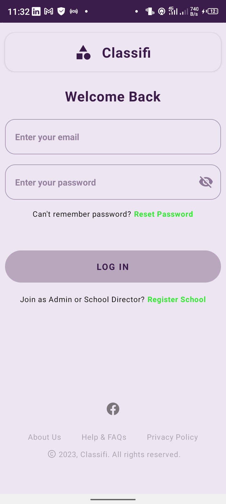
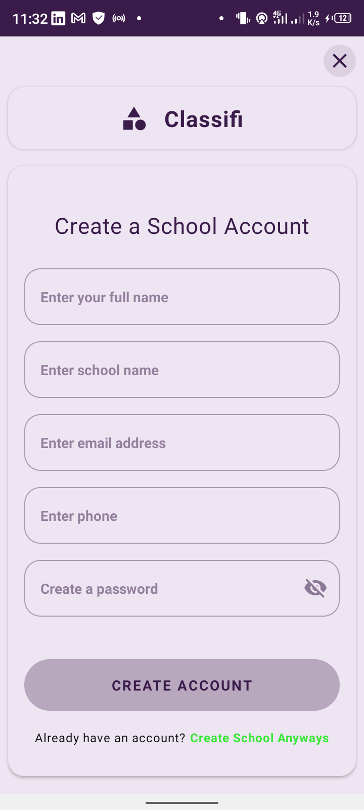
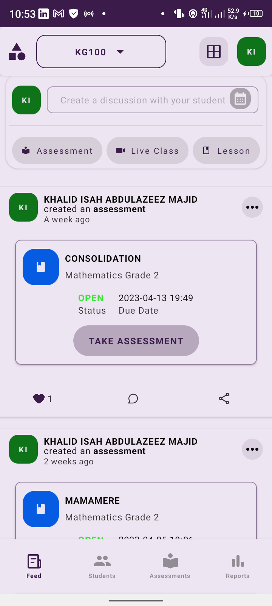
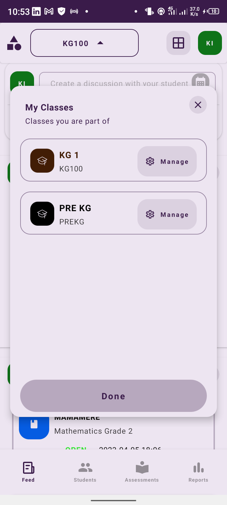
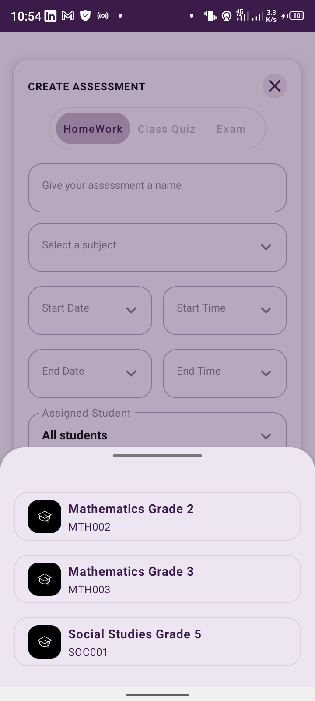
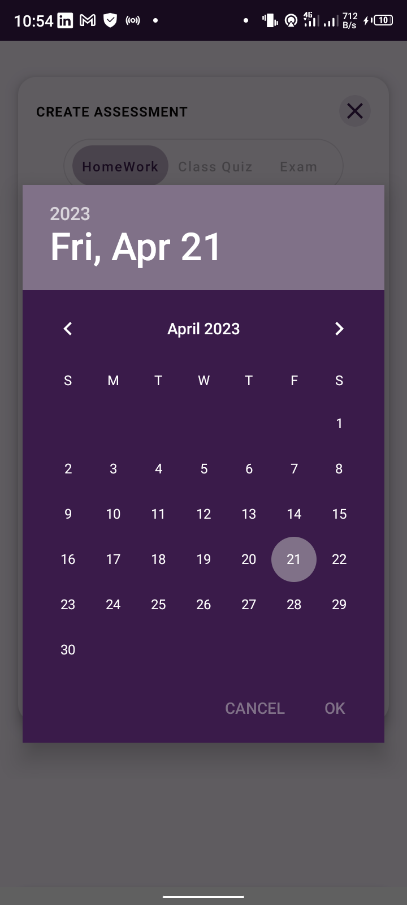
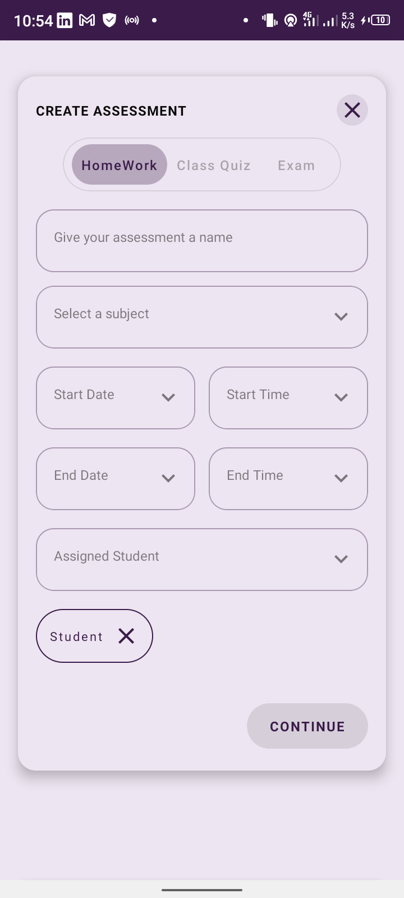
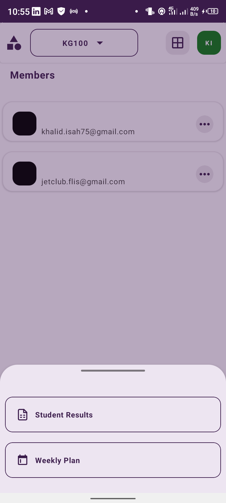
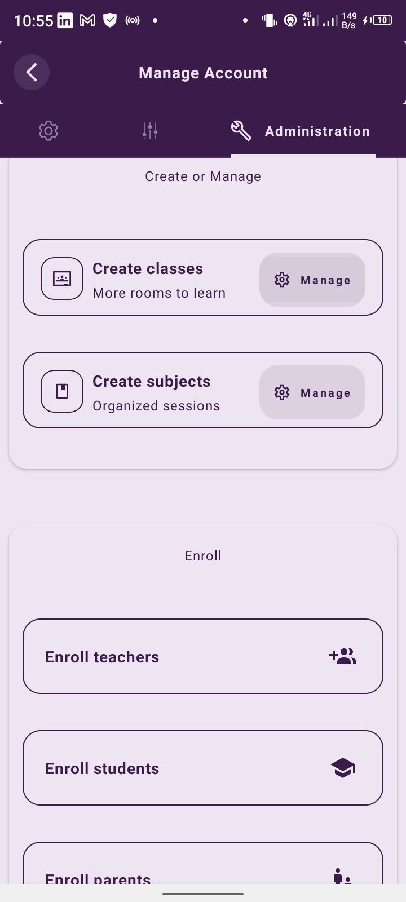
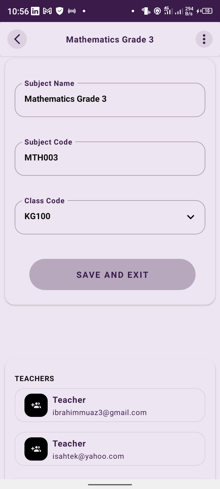

# Introduction 
**Classifi is a smart and convenience-based e-learning platform. Provides stupendous value to students, 
teachers, parents and the management of schools**

### TODOS: 
- [x] Feature to register parents 
- [ ] Feature to populate the registered parents using paging and show parent details
- [ ] Feature to remove parent from school
- [ ] Feature to assign parent to students
- [ ] Feature to register students 
- [ ] Feature to populate the registered student using paging and show student details
- [ ] Feature to remove a student from school 
- [ ] Feature to assign student to class, and parent 
- [ ] Feature to register classes 
- [ ] Feature to populate the registered classes using paging and show class details 
- [ ] Feature to delete class from school
- [ ] Feature to add student, and teacher to class 
- [ ] Feature to register subjects 
- [ ] Feature to populate the registered subjects using paging and show subject details 
- [ ] Feature to delete subject and assign subject to teacher
- [ ] Feature to list all schools joined by user and show school details: parent, teacher and admin only 
- [ ] Feature to list all classes joined by user from a set school, and show class details: admin, student and teacher only 
- [ ] Feature to list all students under the supervision of the said user: for admin, teacher only 
- [ ] Feature to list all subjects affiliated to by user, for admin, teacher, and students only
- [ ] Refactor the codes on the Profile screen to handle the default cases
- [ ] Resolve the gesture scroll feature on the SettingsScreen to be unidirectional 
- [ ] Redesign ComposeFeed screen
- [ ] Feature to get photo from Camera intent 
- [ ] Feature to get video from Camera intent 
- [ ] Feature to choose image from File Chooser 
- [ ] Feature to choose document from File Chooser 
- [ ] Feature to select classes filter before posting a feed 
- [ ] Feature to upload own profile image
- [ ] Feature to load the paged-list of feeds, sorted by date in descending order 
- [ ] Show notification when a new feed is added based on user class 
- [ ] Feature to like and comment on a feed, from the FeedDetail screen 
- [ ] Feature to filter feed based on class
- [ ] Feature to share feed to other classes, and outside the app
- [ ] Feature to show related students on home screen based on user. 
- [ ] Admin: Show list of all students in school
- [ ] Parent: Show list of students under parent 
- [ ] Teacher: Show list of students under teacher 
- [ ] Student: Show list of students in same class 
- [ ] Handle data sync between remote and local 
- [ ] Curate all files under class

### Some Screenshots of the app

