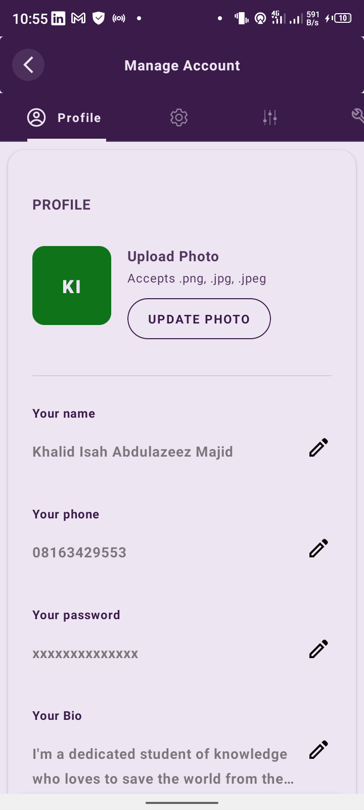

# Introduction 
**Classifi is a smart and convenience-based e-learning platform. Provides stupendous value to students, 
teachers, parents and the management of schools**

### TODOS: 
- [x] Feature to create school and set up admin account
- [x] Feature to create classes in school and sections
- [x] Feature to create subjects in school 
- [x] Feature to enroll teachers into the platform
- [x] Feature to enroll students into the platform 
- [x] Feature to enroll parents into the platform 
- [ ] Feature to manage classes 
- [ ] Feature to manage subjects
- [ ] Feature to reset password
- [ ] Feature to assign classes to teachers 
- [ ] Feature to assign subjects to teachers 
- [ ] Feature for parents to search for wards and link up with them 
- [ ] Feature to accommodate multiple roles 

### Some Screenshots of the app

